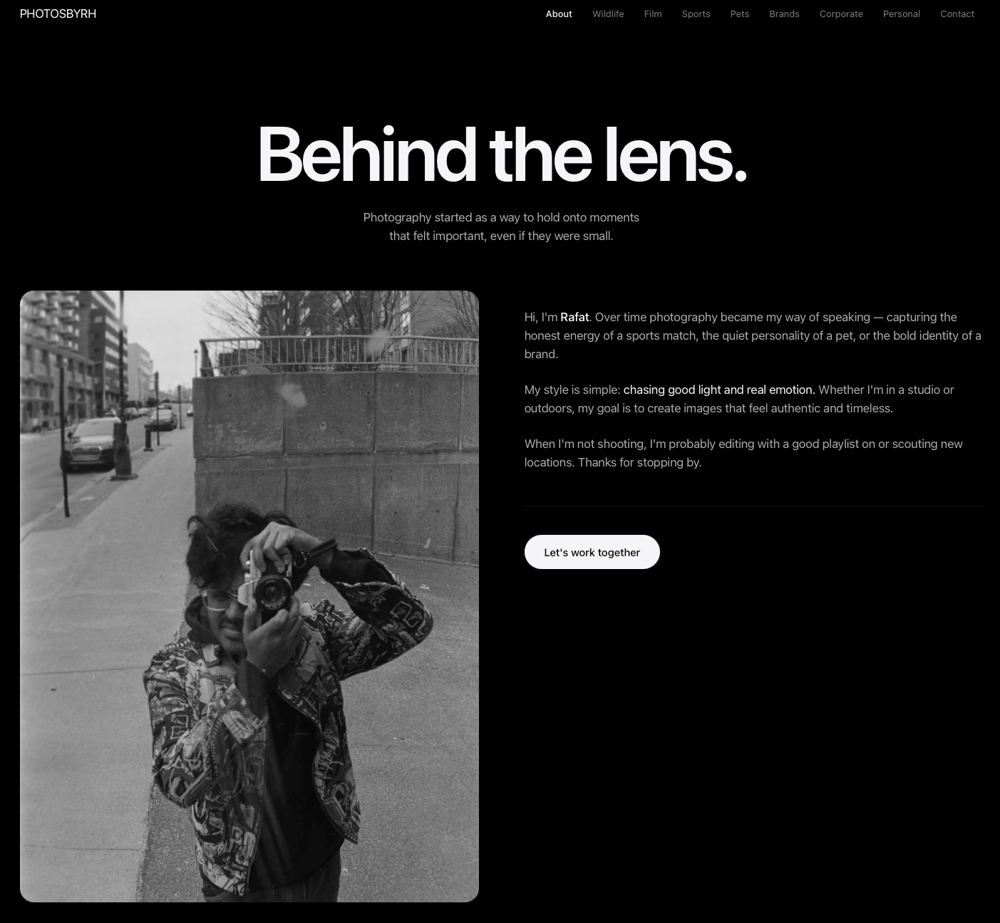

# PhotosByRH

Photography portfolio for Rafat Hossain — wildlife, sports, pets, film, brands, and event work.



**Live:** [photosbyrh.vercel.app](https://photosbyrh.vercel.app)

Built with Next.js 16, React 19, Tailwind CSS v4 and Framer Motion. Page and
grid motion is plain CSS transitions so it runs on the compositor; Framer
Motion is used by the lightbox.

## Design

Type is the system font (SF Pro on Apple platforms), with tracking and leading
set per size rather than one value everywhere — large text tightens, small text
opens up. Anton is kept for the wordmark only. Tokens live in the `@theme` block
of `app/globals.css`, which is the single source of truth; there is no
`tailwind.config.ts`.

The palette is monochrome. On a page that is almost entirely photographs, a
saturated UI colour competes with the only thing meant to carry colour, so the
primary action is a white pill with a black label (19.3:1) rather than a hue.
Every text colour clears WCAG AA against the background it is used on.

Chrome is a translucent material that fades in once content scrolls under it,
and honours `prefers-reduced-transparency` and `prefers-contrast`.

Motion is kept off the critical path deliberately. Hero entrances are CSS
animations so they start at first paint rather than waiting for hydration;
above-the-fold images are never hidden behind a scroll reveal, so the LCP
element paints straight from the HTML; and the lightbox mounts only the photo
that was clicked on its first frame, with its neighbours following once that
photo is on screen.

## Development

```bash
npm install
npm run dev
```

Set `NEXT_PUBLIC_SITE_URL` if the site is served from a domain other than the
default in `app/site.ts` — it drives the sitemap, robots.txt, and Open Graph URLs.

## Images

Photos live in `public/`, one folder per gallery, and are referenced through
static imports so Next can generate blur placeholders and intrinsic dimensions.
After adding new photos, run:

```bash
node scripts/optimize-images.mjs --dry-run   # preview
node scripts/optimize-images.mjs             # resize to 2560px long edge
```

Any `quality` passed to `next/image` must also be listed in `images.qualities`
in `next.config.ts`. Next 16 answers an unlisted quality with a 400 rather than
clamping it, and the failure is invisible in the UI — the image never arrives
and the blur placeholder simply stays up. The lightbox previously requested
quality 85 against the default allow-list of `[75]`, so no full-size photo ever
loaded.

The lightbox requests a `90vw` variant and prefetches its two neighbours, so
arrowing or swiping does not stall on a cold fetch.
