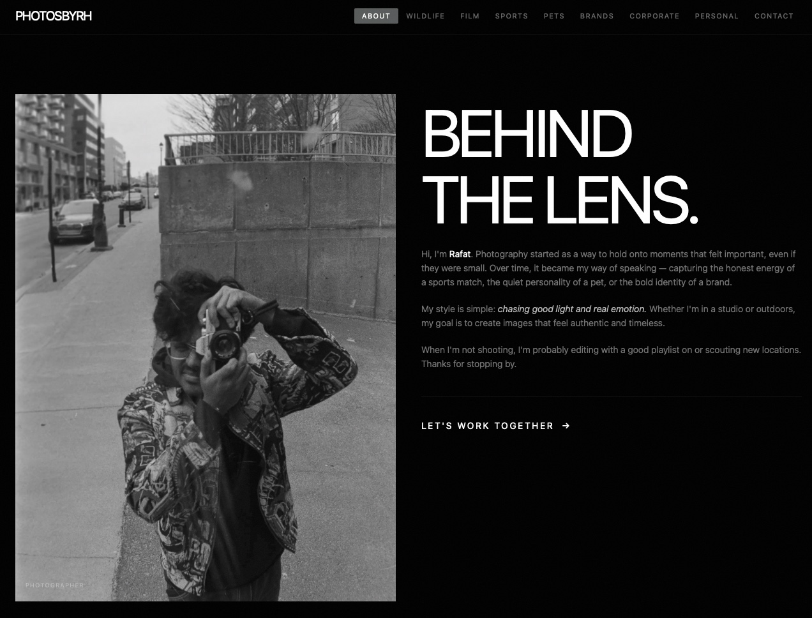

# PhotosByRH

Photography portfolio for Rafat Hossain — wildlife, sports, pets, film, brands, and event work.



**Live:** [photosbyrh.vercel.app](https://photosbyrh.vercel.app)

Built with Next.js 16, React 19, Tailwind CSS v4, and Framer Motion.

## Development

```bash
npm install
npm run dev
```

Set `NEXT_PUBLIC_SITE_URL` if the site is served from a domain other than the
default in `app/site.ts` — it drives the sitemap, robots.txt, and Open Graph URLs.

## Images

Photos live in `public/`, one folder per gallery, and are referenced through
static imports so Next can generate blur placeholders and intrinsic dimensions.
After adding new photos, run:

```bash
node scripts/optimize-images.mjs --dry-run   # preview
node scripts/optimize-images.mjs             # resize to 2560px long edge
```
